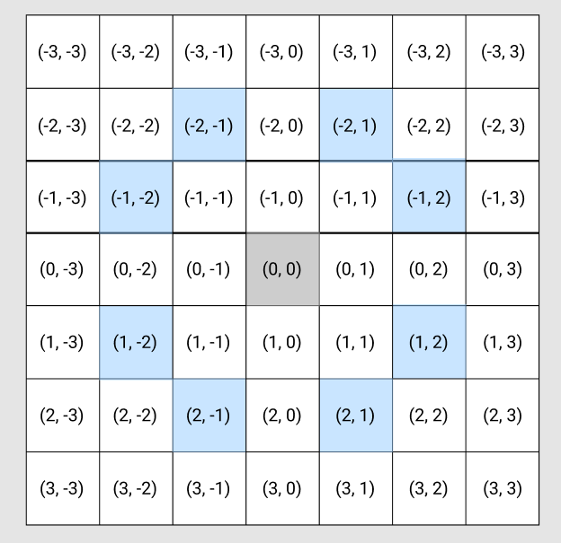

# 왕실의 나이트

> 난이도 🧡🤍🤍 | 풀이 시간 20분 | 시간제한 1초 | 메모리 제한 128MB

행복 왕국의 왕실 정원은 체스판과 같은 `8 * 8` 좌표 평면이다. 왕실 정원의 특정한 한 칸에 나이트가 서있다. 나이트는 매우 충성스러운 신하로써 매일 무술을 연마한다.

나이트는 말을 타고 있기 때문에 이동을 할 때는 L 자 형태로만 이동할 수 있으며, 정원 밖으로는 나갈 수 없다. 나이트는 특정한 위치에서 다음과 같은 2가지 경우로 이동할 수 있다.

1. 수평으로 두 칸 이동한 뒤에 수직으로 한 칸 이동하기
2. 수직으로 두 칸 이동한 뒤에 수평으로 한 칸 이동하기

|  |a |b |c |d |e |f |g |h |
|--|--|--|--|--|--|--|--|--|
|1||||||||
|2||||||||
|3||||||||
|4||||||||
|5||||||||
|6||||||||
|7||||||||
|8||||||||

이처럼 `8 * 8` 좌표 평면상에서 나이트의 위치가 주어졌을 때 나이트가 이동할 수 있는 경우의 수를 출력하는 프로그램을 작성하시오. 이때 왕실의 정원에서 행 위치를 표현할 때는 1 부터 7로 표현하며, 열 위치를 표현할 때는 `a` 부터 `h` 로 표현한다.

예를 들어 만약 나이트가 `a1` 에 있을 때 이동할 수 있는 경우의 수는 다음 2 가지다.
`a1` 의 위치는 좌표 평면애서 구석의 위치에 해당하며 나이트는 정원의 밖으로는 나갈 수 없기 때문이다.

1. 오른쪽으로 두 칸 이동 후 아래로 한 칸 이동하기 (`c2`)
2. 아래로 두 칸 이동 후 오른쪽으로 한 칸 이동하기 (`b3`)

또 다른 예로 나이트가 `c2` 에 위치해 있따면 나이트가 이동할 수 있는 경우의 수는 6 가지 이다. 이건 직접 계산해보시오.

* 입력조건
  * 첫째 줄에 `8 * 8` 좌표 평면상에서 현재 나이트가 위치한 곳의 좌표를 나타내는 두 문자로 구성된 문자열이 입력된다. 입력 문자는 `a1` 처럼 열과 행으로 이루어진다.
* 출력 조건
  * 첫째 줄에 나이트가 이동할 수 있는 경우의 수를 출력하시오
* 입력 예시
> ```
> a1
> ```
* 출력 예시
> ```
> 2
> ```

-------

## 직접 작성한 답안



### Javascript

``` js
/**
 * @param {String} value
 */
 function solution (value) {
	
	const alphabet = ['a', 'b', 'c', 'd', 'e', 'f', 'g', 'h']
	let x = Number(alphabet.indexOf(value[0]))
	let y = Number(value[1])
	// const x = (value.charCodeAt(0)) - ('a'.charCodeAt(0)) + 1  // 99 - 97 + 1 => 3 (c = 3)
	// const y = Number(value[1]) // 2
	let count = 0
	
	const steps = [
		[-1, -2], [1, -2],
		[-2, -1], [2, -1],
		[-2, 1], [2, 1],
		[-1, 2], [1, 2]
	]

	let nx, ny
	for (const step of steps) {
		nx = x + step[1]
		ny = y + step[0]

		// console.log([nx, ny]) // 전
		if (nx <= 0 || ny <= 0 || nx >= 8 || ny >= 8) continue
		// console.log([nx, ny]) // 후
		count += 1
	}

	console.log(count) // 2
}

const result = solution('h8')
```

## 직접 작성한 답안

``` js
/**
 * @param {String} value
 */
function solution (value) {
	
	// const dd = 'A'.charCodeAt(0)
	const alphabet = ['a', 'b', 'c', 'd', 'e', 'f', 'g']
	// let x = Number(alphabet.indexOf(value[0]))
	// let y = Number(value[1])
	let x = 3
	let y = 2
	let count = 0
	
	const steps = [
		[-1, -2], [1, -2],
		[-2, -1], [2, -1],
		[-2, 1], [2, 1],
		[-1, 2], [1, 2]
	]

	let nx, ny
	for (const step of steps) {
		nx = x + step[1]
		ny = y + step[0]

		// console.log([nx, ny]) // 전
		if (nx <= 0 || ny <= 0) continue
		// console.log([nx, ny]) // 후
		count += 1
	}

	console.log(count) // 6
}

const result = solution('c2')
```

## 책 답안 예시

``` python
input_data = input()
row = int(input_data[1]) # 1
column = int(ord(input_data[0])) - int(ord('a')) + 1
# a 위치로부터 어디까지 이동했는지 확인  (97 - 98 = 1)
# ord() :: 문자를 ASCII code (decimal) 로 변환하는 함수

steps = [
  (-2, -1), (-2, 1), (-1, -2), (-1, 2), (1, -2), (2, -1),
  (2, 1), (1, 2)
]

# 나이트가 이동할 수 있는 8 가지 방향 정의
result = 0
for step in steps:
  # 이동하고자 하는 위치 확인
  next_row = row + step[0]
  next_column = column + step[1]
  
  # 해당 위치로 이동이 가능하다면 카운트 증가
  if (next_row > 1 and next_row <= 8 and next_column >= 1 and next_column <= 8):
    result += 1
    
print(result)
```

``` js
/**
 * @param {String} value
 */
function solution (value) {
	
	const column = (value.charCodeAt(0)) - ('a'.charCodeAt(0)) + 1  // 99 - 97 + 1 => 3 (c = 3)
	const row = Number(value[1]) // 2
	let count = 0
	
	const steps = [
		[-1, -2], [1, -2],
		[-2, -1], [2, -1],
		[-2, 1], [2, 1],
		[-1, 2], [1, 2]
	]

	let nx, ny
	for (const step of steps) {
		nx = row + step[1]
		ny = column + step[0]

		// console.log([nx, ny]) // 전
		if (nx >= 1 && nx <= 8 && ny >= 1 && ny <= 8) {
			// console.log([nx, ny]) // 후
			count += 1
		}
	}

	console.log(count) // 6
}

const result = solution('c2')
```

### 해설


```
ex) c1
row = 1, col = 3

(-2, -1)
  row = 1 + (-2) => -1
  col = 3 + (1)  => 2
  ∴ (-1, 2) :: ❌

(-1, -2)
  row = 1 + (-1) => 0
  col = 3 + (-2) => 1
  ∴ (0, 1) :: ✅

(1, -2)
  row = 1 + (1)  => 2
  col = 3 + (-1) => 2
  ∴ (2, 2) :: ✅

(1, -2)
  row = 1 + (1)  => 2
  col = 3 + (-2) => 1
  ∴ (2, 1) :: ✅

(2, -1)
  row = 1 + (1)  => 2
  col = 3 + (-2) => 1
  ∴ (2, 1) :: ✅

(2, 1)
  row = 1 + (2)  => 3
  col = 3 + (1)  => 4
  ∴ (3, 4) :: ✅

(1, 2)
  row = 1 + (1)  => 2
  col = 3 + (2)  => 5
  ∴ (2, 5) :: ✅

(-1, 2)
  row = 1 + (-1) => 0
  col = 3 + (2)  => 5
  ∴ (0, 5) :: ✅

(-2, 1)
  row = 1 + (-2) => -1
  col = 3 + (1)  => 4
  ∴ (-1, 4) :: ❌
```