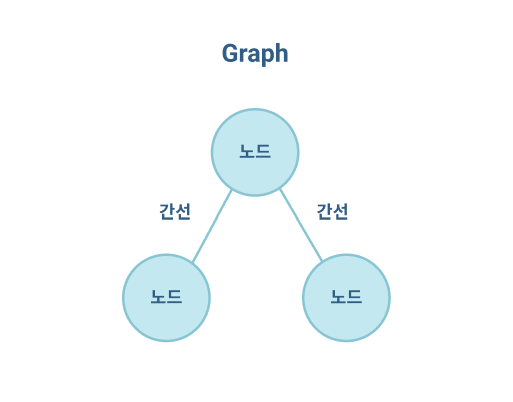
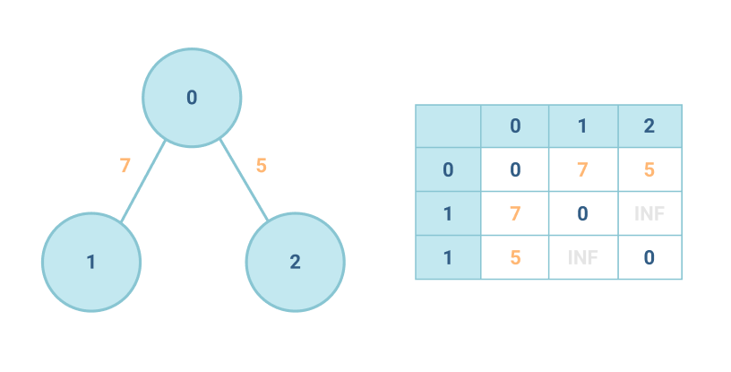
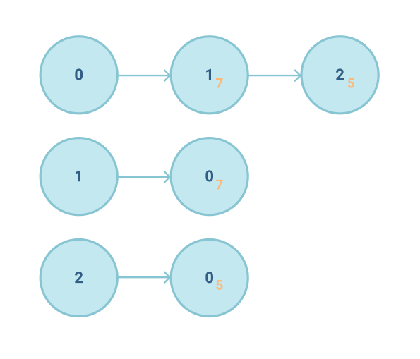
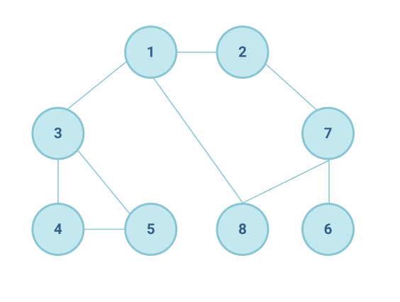

- [그래프](#그래프)
  - [인접 행렬 (Adjacency Matrix) 방식](#인접-행렬-adjacency-matrix-방식)
  - [인접 리스트 (Adjacency List) 방식](#인접-리스트-adjacency-list-방식)
    - [두 방식의 차이점](#두-방식의-차이점)
- [DFS (깊이 우선 탐색: Depth-First Search)](#dfs-깊이-우선-탐색-depth-first-search)
  - [DFS 의 동작 과정](#dfs-의-동작-과정)
    - [DFS 예제](#dfs-예제)
- [BFS (너비 우선 탐색: Breath First Search)](#bfs-너비-우선-탐색-breath-first-search)
  - [BFS 의 동작 과정](#bfs-의-동작-과정)
    - [BFS 예제](#bfs-예제)
- [결론](#결론)


# 그래프



> **그래프**를 탐색하기 위한 대표적인 두 가지 알고리즘 \
> *노드(Node)*(*정점(Vertex)* 이라고도 부른다) 와 *간선(Edge)* 로 이루어진 자료구조

**그래프 탐색**이란, 하나의 노드를 시작으로 다수의 노드를 방문하는 것을 말한다. \
두 노드가 간선으로 연결되어있다면 '두 노드는 인접하다(Adjacent)' 라고 표현한다.


프로그래밍에서 그래프는 크게 2가지 방식으로 표현할 수 있는데, \ 코딩테스트에서는 두 개념 모두가 필요하다. 

* **인접 행렬 (Adjacency Matrix)** : **2차원 배열**로 그래프의 연결 관계를 표현하는 방식
* **인접 리스트 (Adjacency List)** : **리스트**로 그래프의 연결 관계를 표현하는 방식

## 인접 행렬 (Adjacency Matrix) 방식



> 2차원 배열에 각 노드가 연결된 형태를 기록하는 방식

``` python
# 인접행렬 방식 예시
# 연결되지 않은 노드끼리는 무한(`Infinity`) 의 비용(주로 `999999999`)으로 작성한다.

INF = 999999999  # 무한의 비용 선언

# 2차원 리스트를 이용해 인접행렬 표현
graph = [
	[ 0, 7, 5 ],
	[ 7, 0, INF ],
	[ 5, INF, 0 ]
]

print(graph)
# [ 0, 7, 5 ], [ 7, 0, 999999999 ], [ 5, 999999999, 0 ]
```

## 인접 리스트 (Adjacency List) 방식



> 모든 노드에 연결된 노드에 대한 정보를 차례대로 연결하여 저장

> 인접리스트는 '연결리스트' 자료구조를 이용하여 구현하는데, 인접 리스트를 구현할 때에도 단순히 2차원 리스트를 이용하면 된다.

``` python
# 행(Row)이 3 개인 2차원 리스트로 인접리스트 표현
graph = [[] for _ in range(3)]     # [[], [], []]

# 노드 0 에 연결된 노드 정보 저장 (노드, 거리)
graph[0].append((1, 7))
graph[0].append((2, 5))     # [(1, 7), (2, 5)], [], []]

# 노드 1 에 연결된 노드 정보 저장 (노드, 거리)
graph[1].append((0, 7))     # [[(1, 7), (2, 5)], [(0, 7)], []]

# 노드 2 에 연결된 노드 정보 저장 (노드, 거리)
graph[2].append((0, 5))     # [[(1, 7), (2, 5)], [(0, 7)], [(0, 5)]]

print(graph)
```

### 두 방식의 차이점

|                  | 메모리 측면                                                                                                                                                   |     |
| ---------------- | ------------------------------------------------------------------------------------------------------------------------------------------------------------- | --- |
| 인접 행렬 방식   | 모든 관계를 저장하므로 노드 개수가 많을수록 메모리가 불필요하게 낭비된다                                                                                      |     |
| 인접 리스트 방식 | 연결된 정보만 저장하기 때문에 메모리를 효율적으로 사용한다 <br> 하나씩 연결된 노드를 확인해야하므로 두 노드가 연결되어있는지에 대한 정보를 얻는 시간이 느리다 |


# DFS (깊이 우선 탐색: Depth-First Search)
> *그래프*에서 깊은 부분을 우선적으로 탐색하는 알고리즘 \
> 특정한 경로로 탐색하다가 특정한 상황에서 최대한 깊숙히 들어가서 노드를 방문한 후, 다시 돌아가 경로를 탐색하는 알고리즘

## DFS 의 동작 과정

DFS 알고리즘은 스택 자료구조에 기초한다는 점에서 구현이 간단하다. \
실제로는 스택을 쓰지 않아도 되며 탐색을 수행함에 있어서 데이터의 개수가 N 개인 경우 `O(N)` 의 시간이 소요된다는 특징이 있다.

1. 탐색 시작 노드를 **스택에 삽입**하고 **방문 처리**를 한다
2. 스택의 최상단 노드에 방문하지 않은 인접 노드가 있으면 그 인접 노드를 스택에 넣고 방문 처리를 한다.\
방문하지 않은 노드가 없으면 스택에서 최상단 노드를 꺼낸다.
3. 2 번의 과정을 더이상 수행할 수 없을 때까지 반복한다.

<sub>방문처리 :: 스택에 한 번 삽입되어 처리된 노드가 다시 삽입되지 않도록 체크하는 것 의미.</sub>

### DFS 예제



``` python
# DFS 메서드 정의
def dfs(graph, v, visited):
  # 현재 노드를 방문 처리
  visited[v] = True
  print(v, end=' ')
  
  # 현재 노드와 연결된 다른 노드를 재귀적으로 방문
  for i in graph[v]:
    if not visited[i]:
      dfs(graph, i, visited)

# 각 노드가 연결된 정보를 리스트 자료형으로 표현 (2차원 리스트)
graph = [
  [],
  [2, 3, 8],  # node 1 의 연결리스트
  [1, 7],     # node 2 의 연결리스트
  [1, 4, 5],  # node 3 의 연결리스트 ...
  [3, 5],
  [3, 4],
  [7],
  [2, 6, 8],
  [1, 7]
]

# 긱 노드가 방문된 정보를 리스트 자료형으로 표현 (1차원 리스트)
visited = [False] * 9   # [False, False, ..., False]

# 정의된 DFS 함수 호출
dfs(graph, 1, visited)  # 1 2 7 6 8 3 4 5
```


# BFS (너비 우선 탐색: Breath First Search)

가까운 노드부터 탐색하는 알고리즘이다. \
DFS 는 최대한 멀리있는 노드를 우선으로 탐색하는 방식으로 동작한다고 했는데, BFS 는 그 반대다.

BFS 구현에서는 **큐 자료구조를 이용**하는 것이 정석이다. \
인접한 노드를 반복적으로 큐에 넣도록 알고리즘을 작성하면 자연스럽게 먼저 들어온 것이 먼저 나가게 되어, 가까운 노드부터 탐색을 진행하게된다.

## BFS 의 동작 과정

1. 탐색 시작 노드를 **큐에 삽입**하고 **방문처리**를 한다.
2. 큐에서 노드를 꺼내 해당 노드의 인접 노드 중에서 방문하지 않은 노드를 모두 큐에 삽입하고 방문 처리를 한다.
3. 2 번의 과정을 더 이상 수행할 수 없을 때까지 반복한다.

### BFS 예제

``` python
from collections import deque
# BFS 메서드 정의
def bfs(graph, start, visited):
  # 큐 (Queue) 구현을 위해 deque 라이브러리 사용
  queue = deque([start])
  
  # 현재 노드를 방문처리
  visited[start] = True
  
  # 큐가 빌 때까지 반복
  while queue:
    # 큐에서 하나의 원소를 뽑아 출력
    v = queue.popleft()
    print(v, end=' ')
    
    # 해당 원소와 연결된, 아직 방문하지 않은 원소들을 큐에 삽입
    for i in graph[v]:
      if (not visited[i]):
        queue.append(i)
        visited[i] = True
        
graph = [
  [],
  [2, 3, 8],  # node 1 의 방문노드
  [1, 7],     # node 2 의 방문노드
  [1, 4, 5],  # node 3 의 방문노드...
  [3, 5],
  [3, 4],
  [7],
  [2, 8, 6],
  [1, 7]
]

# 각 노드가 방문된 정보를 리스트 자료형으로 표현 (1차원 리스트)
visited = [False] * 9

# 정의된 BFS 함수 호출
bfs(graph, 1, visited)   # 1 2 3 8 7 4 5 6
```

# 결론

|          | DFS            | BFS              |
| -------- | -------------- | ---------------- |
| 동작원리 | 스택           | 큐               |
| 구현방법 | 재귀 함수 이용 | 큐 자료구조 이용 |


