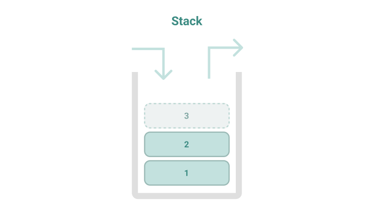
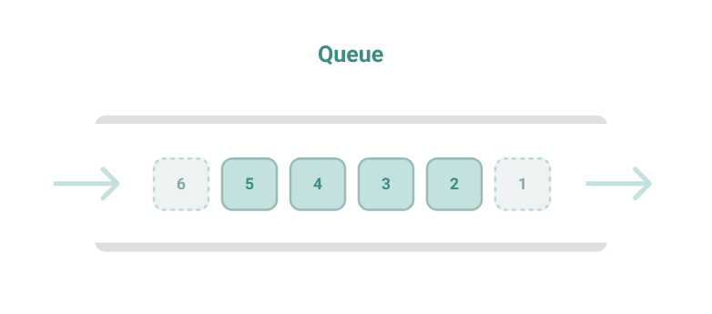

# 탐색, 자료구조

## 탐색 (Search)
> 많은 양의 데이터 중에서 원하는 데이터를 찾는 과정

프로그래밍에서는 그래프, 트리 등의 자료구조 안에서 탐색을 하는 문제를 자주 다룬다. 대표적인 탐색 알고리즘으로는 *DFS*, *BFS* 를 꼽을 수 있는데, 이 두 알고리즘의 원리를 제대로 이해해야 코딩 테스트의 탐색 문제 유형을 풀 수 있다. 그런데 DFS 와 BFS 를 제대로 이해하려면 기본 자료구조인 스택과 큐에 대한 이해가 전제되어야 한다.

## 자료구조(Data Structure)
> 데이터를 표현, 관리, 처리 하기 위한 구조

스택과 큐를 사용할 때는 삽입/삭제/오버플로우/언더플로우 모두를 고민해야한다.


* **삽입 (Push)** : 데이터 삽입
* **삭제 (Pop)** : 데이터 삭제
* **오버플로 (Overflow)** : 특정한 자료구조가 수용할 수 있는 데이터의 크기를 이미 가득 찬 상태에서 삽입 연산을 수행할 때 발생. \
저장공간을 벗어나 데이터가 넘쳐 흐를 때 발생
* **언더플로 (Underflow)** : 자료구조에 데이터가 전혀 들어있찌 않은 상태에서 삭제 연산을 수행할 때 발생

## 자료구조 종류

### 스택 (Stack)


> 선입 후출 (First In Last Out) 또는 후입 선출 (Last In First Out) 구조

*재귀 함수(Recursive Function)* 의 연속해서 호출되는 함수는, 메인 메모리의 스택 공간에 적재되므로 스택 자료구조와 같다고 볼 수 있다. \
따라서 스택 자료구조를 활용해야하는 상당수 알고리즘은 **재귀 함수를 이용하여 간편하게 구현할 수 있다.**

### 큐 (Queue)




### 재귀함수 (Recursive Function)

> 자기 자신을 호출하는 함수


#### 계승 (Factorial)
재귀함수를 이용하는 대표적인 예제로는 팩토리얼 문제가 있다.

팩토리얼은 기호로 간단하게 `n!` 로 나타내며, `1`부터 `n` 까지의 자연수를 모두 곱하는것을 의미한다.

```
n! = 1 * 2 * 3 * ... * (n - 1) * n
```

수학적으로 `0!` 과 `1!` 의 값은 `1` 로 같다는 성질을 이용하여, 팩토리얼 함수는 `n` 이 `1` 이하가 되었을 때 함수를 종료하는 재귀함수의 형태로 구현할 수 있다.
