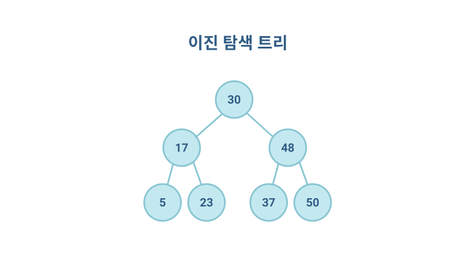

- [이진탐색](#이진탐색)
  - [순차 탐색](#순차-탐색)
  - [이진탐색 : 반으로 쪼개면서 탐색하기](#이진탐색--반으로-쪼개면서-탐색하기)
  - [트리 자료구조](#트리-자료구조)
  - [이진 탐색 트리](#이진-탐색-트리)


# 이진탐색
> 리스트 내에서 탐색 범위를 반으로 좁혀가며 데이터를 빠르게 탐색하는 알고리즘

## 순차 탐색
> 리스트 안에 있는 특정한 데이터를 찾기 위해 앞에서부터 데이터를 하나씩 차례대로 확인하는 방법 (일반적인 탐색)

``` python
# 순차탐색 코드 구현
def sequential_search(n, target, array):
  # 각 원소를 하나씩 확인하며
  for i in range(n):
    # 현재의 원소가 찾고자하는 원소와 동일한 경우
    if array[i] == target:
      return i + 1 # 현재의 위치 반환 (인덱스 0 부터 시작하므로 1 더하기)
    
print('생성할 원소 개수를 입력한 다음 한 칸 띄고 찾을 문자열 입력')
input_data = input().split()
n = int(input_data[0]) # 원소의 개수
target = input_data[1] # 찾고자하는 문자열

print('앞서 적은 원소 개수만큼 문자열을 입력하세요. 구분은 띄어쓰기 한 칸으로 합니다..')
array = input().split()

# 순차 탐색 수행 결과 출력
print(sequential_search(n, target, array))

# 생성할 원소 개수를 입력한 다음 한 칸 띄고 찾을 문자열 입력
# > 5 Donbin
# 앞서 적은 원소 개수만큼 문자열을 입력하세요. 구분은 띄어쓰기 한 칸으로 합니다..
# > Hanul Jonggu Donbin Taeil Sanwook
# 3
```

* 시간 복잡도 : 최악의 경우 `O(N)`
* 연산 횟수 : 앞에있는 원소부터 하나씩 확인해야하므로 최대 N 번의 비교연산이 필요함


## 이진탐색 : 반으로 쪼개면서 탐색하기

> 배열 내부의 데이터가 정렬되어있어야만 사용할 수 있는 알고리즘 (데이터가 무작위일때는 사용 불가) \
> 탐색 범위를 절반씩 좁혀가며 데이터를 탐색

이진 탐색은 위치를 나타내는 변수 3개 (탐색하고자 하는 범위의 **시작점**, **끝점**, **중간점**) 를 사용한다.

**찾으려는 데이터와 중간점 위치에 있는 데이터를 반복적으로 비교**해서 원하는 데이터를 찾는게 이진 탐색 과정이다.

이진탐색을 구현하는 방법에는 **재귀를 이용하는 방법** 과, **반복문을 이용하는 방법** 두 가지가 있다. 

``` python
# 재귀함수
def binary_search(array, target, start, end):
  if (start > end): return None # 원소가 없는 경우
  mid = (start + end) // 2 # 중간점 설정
  
  # 찾은 경우 중간점 인덱스 반환
  if (array[mid] == target): return mid
  # 중간점의 값 > 찾는 값 ? 왼쪽 확인
  elif (array[mid] > target):
    return binary_search(array, target, start, mid - 1)
  # 중간점의 값 < 찾는 값 ? 오른쪽 확인
  else:
    return binary_search(array, target, mid + 1, end)
  
# n(원소의 개수)과 target(찾고자 하는 문자열) 입력받기
n, target = list(map(int, input().split()))

# 전체 원소 입력받기
array = list(map(int, input().split()))

# 이진 탐색 수행 결과 출력
result = binary_search(array, target, 0, n - 1)

if result == None:
  print('원소가 존재하지 않습니다')
else:
  print(result + 1)
```

``` js
// 재귀 호출
function binary_search (array, target, start, end) {
	if (start > end) return null
	const mid = parseInt((start + end) / 2)
	
	// 찾은 경우 중간점 인덱스 반환
	if (array[mid] === target) return mid
	
	// 중간점의 값 > 찾는 값 ? 왼쪽 확인
	else if (array[mid] > target) return binary_search(array, target, start, mid - 1)

	// 중간점의 값 < 찾는 값 ? 오른쪽 확인
	else return binary_search(array, target, mid + 1, end)
}

const array = [1, 3, 5, 7, 9, 11, 13, 17, 19]
const n = array.length
const target = 7
const result = binary_search(array, target, 0, n - 1)
console.log(result) // 3
```

``` python
# 반복문
def binary_search(array, target, start, end):
  while (start <= end):
    mid = (start + end) // 2
    
    # 찾은 경우 중간점 인덱스 반환
    if (array[mid] == target): return mid
    # 중간점의 값 > 찾는 값 ? 왼쪽 확인
    elif (array[mid] > target):
      end = mid - 1
    # 중간점의 값 < 찾는 값 ? 오른쪽 확인
    else:
      start = mid + 1

  return None
  
# n(원소의 개수)과 target(찾고자 하는 문자열) 입력받기
n, target = list(map(int, input().split()))

# 전체 원소 입력받기
array = list(map(int, input().split()))

# 이진 탐색 수행 결과 출력
result = binary_search(array, target, 0, n - 1)

if result == None:
  print('원소가 존재하지 않습니다')
else:
  print(result + 1)
```

``` js
// 반복문
function binary_search (array, target, start, end) {
	while (start <= end) {
		const mid = parseInt((start + end) / 2)
		console.log(mid)

		// 찾은 경우 중간점 인덱스 반환
		if (array[mid] === target) return mid
		
		// 중간점의 값 > 찾는 값 ? 왼쪽 확인
		else if (array[mid] > target) end = mid - 1

		// 중간점의 값 < 찾는 값 ? 오른쪽 확인
		else start = mid + 1
	}

	return null
}

const array = [1, 3, 5, 7, 9, 11, 13, 17, 19]
const n = array.length
const target = 7
const result = binary_search(array, target, 0, n - 1)
console.log(result) // 3
```

* 시간 복잡도 : $O(log N)$
* 효율성 : 탐색으 의 한 단계를 거칠 때 마다 원소가 평균적으로 절반으로 줄어든다. 

<small>코드가 짧으니 이진 탐색은 여러 차례 코드를 입력하며 자연스럽게 외워보자. 이진 탐색은 코딩테스트에서 단골로 나오는 문제이니 가급적 외우길 권장한다.</small>


-----


## 트리 자료구조

> 트리 자료구조는 노드와 노드의 연결로 표현 한다. (노드: 정보의 단위로서 어떠한 정보를 가지고 있는 개체) \
> 그래프 자료구조의 일종으로 데이터베이스 시스템이나 파일 시스템 과 같은 곳에서 많은 양의 데이터를 관리하기 위한 목적으로 사용한다.

* 트리는 *부모 노드 Parent Node*와 *자식 노드 Child Node*의 관계로 표현한다.
* 트리의 최상단 노드를 *루트 노드 Root Node* 라고 한다.
* 트리의 최하단 노드를 *단말 노드 Leaf Node* 라고 한다.
* 트리에서 일부를 떼어네도 트리구조이며 이를 *서브 트리* 라고 한다.
* 트리는 파일 시스템과 같이 계층적이고 정렬된 데이터를 다루기에 적합하다.


## 이진 탐색 트리



> 트리 자료구조중 가장 간단한 형태 \
> 이진 탐색 트리란 이진 탐색이 동작할 수 있도록 고안된, 효율적인 탐색이 가능한 자료구조이다.

* 부모노드보다 왼쪽 자식 노드가 작다
* 부모노드보다 오른쪽 자식 노드가 크다
* 왼쪽 자식 노드 < 부모 노드 < 오른쪽 자식 노드

