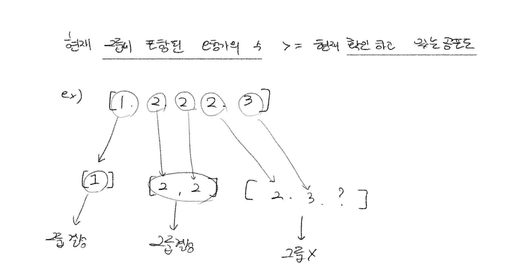

# 모험가 길드

> 난이도 🧡🤍🤍 | 풀이시간 30분 | 시간제한 1초 | 메모리 제한 128MB | 기출 핵심유형

한 마을에 모험가가 N 명 있습니다. 모험가 길드에서는 N 명의 모험가를 대상으로 '공포도' 를 측정했는데, '공포도' 가 높은 모험가는 쉽게 공포를 느껴 위험 상황에서 제대로 대처할 능력이 떨어집니다. 모험가 길드장인 동빈이는 모험가 그룹을 안전하게 구성하고자 공포도가 X 인 모험가는 반드시 X 명 이상으로 구성한 모험가 그룹에 참여해야 여행을 떠날 수 있도록 규정했습니다. 동빈이는 최대 몇 개의 모험가 그룹을 만들 수 있는지 궁금합니다.

동빈이를 위해 N 명의 모험가에 대한 정보가 주어졌을 때, 여행을 떠날 수 있는 그룹위 최댓값으 구하는 프로그램을 작성하세요.

예를 들어 `N = 5` 이고, 각 모험가의 공포도가 다음과 같다고 가정합시다.

``` python
2 3 1 2 2
```

이때, 그룹 1 에 공포도가 1, 2, 3 인 모험가를 한 명씩 넣고, 그룹 2에 공포도가 2인 남은 두 명을 넣게 되면 총 2 개의 그룹을 만들 수 있습니다. 또한 몇 명의 모험가는 그대로 남아있어도 되기 때문에, 모든 모험가를 특정한 그룹에 넣을 필요는 없습니다.

* 입력 조건
  * 첫째 줄에 모험가의 수 N 이 주어집니다.
  * 둘째 줄에 각 모험가의 공포도 값을 N 이하의 자연수로 주어지며, 각 자연수는 공백으로 구분합니다.

* 출력 조건
  * 여행을 떠날 수 있는 그룹 수의 최댓값을 출력합니다.

* 입력 예시

``` python
5
2 3 1 2 2
```

* 출력 예시

``` python
2
```

-----

## 책 답안 예시



``` js
/**
 * 
 * @param array 
 */
 function solution (array) {
  array.sort() // 정렬하면 그룹을 결성할 수 있는 모험가를 하나도 빠짐없이 확인가능하다 
  array
  
  result = 0 // 총 그룹의 수
  count = 0  // 현재 그룹에 포함된 모험가의 수

  for (const i of array) {
    count += 1 // 현재 그룹에 해당 모험가를 포함시키기
    if (count >= i) { // 현재 그룹에 포함된 모험가의 수가 현재의 공포도 이상이라면, 그룹 결성
      result += 1 // 총 그룹의 수 증가시키기
      count = 0 // 현재 그룹에 포함된 모험가의 수 초기화
    }
  }

  console.log(result)
  return result
}


const array = [2, 3, 1, 2, 2]
// const array = [8, 2, 1, 4, 3]
solution(array)
```
