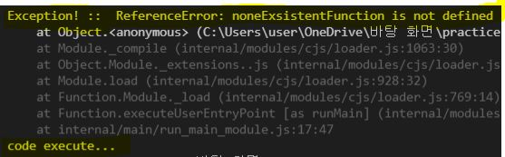
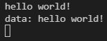
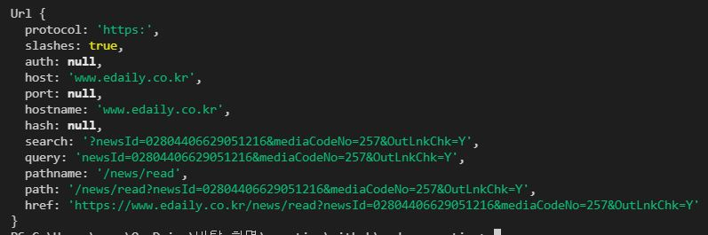
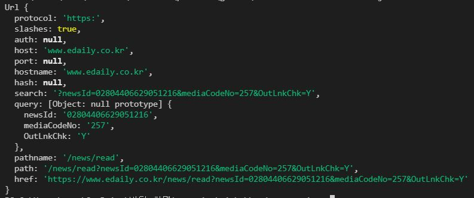

# 노드의 기본 모듈

- [노드의 기본 모듈](#노드의-기본-모듈)
  - [`global` - 전역 객체](#global---전역-객체)
  - [`util` - 유틸리티](#util---유틸리티)
  - [`event` - 이벤트](#event---이벤트)
  - [`Buffer` - 버퍼](#buffer---버퍼)
  - [`Stream` - 스트림](#stream---스트림)
  - [`fs` - 파일 시스템](#fs---파일-시스템)
  - [`path` - 경로](#path---경로)
  - [`net` - 네트워크](#net---네트워크)
  - [`http`, `https` -  HTTP와 HTTPS](#http-https----http와-https)
  - [`url`, `query` - URL 과 쿼리 문자열](#url-query---url-과-쿼리-문자열)
  - [`child_process` - 자식 프로세스](#child_process---자식-프로세스)
  - [Cluster](#cluster)
    - [TCP 를 이용한 채팅 예제](#tcp-를-이용한-채팅-예제)
    - [모듈 종류 정리](#모듈-종류-정리)

해당 포스트에서는 노드가 제공하는 기본 모듈을 살펴봅니다. 노드에 포함된 모듈을 *기본 모듈* 이라고 부르고, 추가 설치가 필요한 모듈은 *확장 모듈* 이라고 합니다.

## `global` - 전역 객체

*전역 객체* `global` 는 **모든 스코프에서 접근 가능할 수 있는 객체**를 말합니다.

client javascript 에서는 `window` 가 전역 객체입니다. 노드에서 전역 객체는 `global` 이라는 이름으로 존재합니다. `console.log()`, `require()`, `setTimeout()` 등의 함수를 포함합니다. 편의상 `global` 은 생략할 수 있습니다.

`global` 객체에는 아래와 같은 변수들이 있습니다.

| 타입 | 이름         | 기능                                      | 참고                                                                      |
| ---- | ------------ | ----------------------------------------- | ------------------------------------------------------------------------- |
| var  | `__filename` | 현재 실행된 파일 위치                     |                                                                           |
| var  | `__dirname`  | 현재 실행된 디렉터리                      |                                                                           |
| obj  | `process`    | 실행된 노드 프로세스 정보를 담고있는 객체 | OSType, 실행 시간, 메모리 사용률, 워킹 디렉토리 등 포함. 이벤트 사용 가능 |
|      |              |

``` js
  console.log(__finename)
  // fileName : C:\Users\user\OneDrive\바탕 화면\practice\github\node-execution\node.js
  console.log(__dirname)
  // C:\Users\user\OneDrive\바탕 화면\practice\github\node-execution

  // process 객체
  process.execPath  // C:\Program Files\nodejs\node.exe
  process.cwd()     // C:\Users\user\OneDrive\바탕 화면\practice\github\node-execution
  process.env       // 중략
                    // 운영 체제의 환경 변수 process.env.PATH 로 접근
                    // DB 접근 정보, id, pw 등의 변수들은 환경변수에 저장합니다.
  process.version   // v14.16.1
  process.versions  // 중략
  process.arch      // x64
  process.platform  // win32
  process.memoryUsage()   // V8 의 res, heapTotal, heapUsed, external, arrayBuffers
  process.uptime()  // 0.0498826
  process.exit()
  process.on('exit', () => console.log('Bye')) // 프로세스가 종료될 때 exit 이벤트 발생
```

``` js
  // process 객체의 event 사용법
  // try-catch 문을 사용하지 않은 코드에서 에러를 출력하며 프로세스가 종료됩니다.
  // uncaughtException 이벤트 리스너를 등록하면 예상치 못한 예외 처리가 가능합니다.
  process.on('uncaughtException', err => {
      console.error('Exception! :: ', err)
  })

  setTimeout(() => {
      console.log('code execute...')
  }, 500)

  noneExsistentFunction() // 존재하지 않는 함수

  console.log('not execute...') // 실행되지 않음
```
  > 

``` js
  process.stdin.resume()
  process.stdin.setEncoding('utf-8')

  process.stdin.on('data', chunk => {
      process.stdout.write('data: ' + chunk)
  })
  process.stdin.on('end', () => { // 종료이벤트 (window 에서는 발생X)
      process.stdout.write('end')
  })
```

> 

``` js
  process.argv.forEach((val, idx, arr) => {
      console.log(val, idx, arr)
  })

  // $ node node.js one two=three four

  // node 명령어로부터 공백으로 구분된 모든 명령어(one, two=three, four)가
  // process.argv 에 저장됨
```

``` js
  process.nextTick(() => {
      console.log('2 - is nextTick')
  })
  console.log('1')

  // 1
  // 2 - is nextTick
  // nextTick 의 콜백 함수는 바로 실행하지 않고 이벤트 큐에 등록합니다. 싱글 스레드가 현재 작업을 완료하고 다음이벤트를 처리할 수 있는때가 되면 콜백함수를 차례로 실행합니다. 비동기적으로 사용하는 setTimeout() 나 다른 I/O 함수 보다 훨씬 더 빠르게 동작합니다.
```

## `util` - 유틸리티

*유틸리티 모듈* 은 `require('util')` 로 불러와 사용합니다.

``` js
  const util = require('util')

  util.format('%s is %d', 'Today', 210511) // 'Today is 210511'
  util.types.isRegExp(/regExp/) // true
  util.types.isDate(new Date()) // true
```

| placeholder (%) |        |
| --------------- | ------ |
| `%s`            | String |
| `%d`            | Number |
| `%j`            | JSON   |
| `%%`            | %      |

## `event` - 이벤트

노드는 많은 객체가 이벤트를 발생시킬 수 있습니다. `require('events')` 로 불러옵니다. 

웹 서버에 새로운 요청이 들어오거나, 파일읽기가 완료되었을 때 등 일 때이벤트가 발생하는데, 발생하는 이벤트는 모두 `events.EventEmitter` 의 객체이며, `require('events').EventEmitter` 로 접근합니다.

*이벤트 발생*은 `emit` 이라는 단어를 사용하며, *이벤트 발생 함수*를 listener 라고 부릅니다. EventEmitter 객체에서 에러가 발생하면 `error` 이벤트가 발생합니다. `error` 이벤트에 listener 가 등록된 경우 listener 를 실행하고, 없으면 스택 트레이스를 출력하고 앱을 종료합니다.

``` js
  const server = require('http')

  server.createServer(function(req,resp) {
      resp.writeHead(200, { 'Content-Type': 'text/plain' })
      resp.end('Hello World\n')
  })
    .listen(3000, 'localhost')
    .on('connection', stream => {
        console.log('서버에 연결되었습니다.')
    })
```

* 객체에 **이벤트를 추가**
  * `emitter.addEventListener(event, listener)` 또는 `emitter.on(event, listener)` 를 사용 
  * `emitter` 는 `EventEmitter` 의 객체여야함
  * 매개변수
    * `event` { string } 이벤트 이름
    * `listener` { function } 이벤트가 발생했을 때 실행할 함수
  * 새로운 listener 가 추가될 때마다 `newListener` 이벤트가 발생합니다.

``` js
  // ...
  .once('connection', stream => {
    // 최초 한번만 실행되고, listener 배열에서 제거됩니다.
    console.log('첫 번째 접속')
  })
    // 지정한 이벤트에서 전달한 listener 를 제거합니다.
  .removeListener('connection', () => console.log('BYE!'))
    // 전달한 모든 listener를 제거합니다.
  .removeAllListeners(['connection'], () => console.log('BYE!'))
```

## `Buffer` - 버퍼

자바스크립트는 유니코드에는 적합하지만, 바이너리 데이터(양방향 데이터) 는 잘 다루지 못합니다.

TCP 스트림이나 파일 스트림을 사용하려면 *옥텟 스트림*octet stream 을 다룰 수 있어야 합니다. 옥텟은 8 bit 로 이루어진 단위를 의미합니다. 모든 컴퓨터가 8 bit 를 1 bite 로 사용하지는 않으므로, 8 bit 로 이루어진 데이터임을 분명히 하기 위해 옥텟 단위를 사용합니다.

Node.js 는 옥텟 스트림을 다루는 함수를 전역 객체은 `Buffer` 클래스로 제공합니다. raw 데이터 는 모두 `Buffer` 클래스 객체에 저장됩니다. `Buffer` 는 **정수의 배열**인데, 각 정수는 V8 heap 메모리 밖의 raw 메모리에 할당된 주소를 가리킵니다.

javascript 문자열과 buffer 사이에 변환을 하기 위해서는 인코딩을 지정해야합니다.

| 인코딩 타입    | 설명                                                                                                                                                              |
| -------------- | ----------------------------------------------------------------------------------------------------------------------------------------------------------------- |
| **ascii**      | 7 bit ASCII 데이터로, 아주 빠릅니다. 7 bit 보다 높은 bit 가 설정되어있으면 제거합니다. <br> `null` 문자인 `\0` 이나  `\u0000` 을 공백문자인 0x20 으로 변환합니다. |
| **utf8**       | 멀티바이트로 인코딩된 유니코드 문자입니다.                                                                                                                        |
| **ucs2**       | 2 bite 리틀 엔디언litter endial 으로 인코딩된 유니코드 문자입니다.                                                                                                |
| **base64**     | Base64 문자열 인코딩 입니다.                                                                                                                                      |
| **hex**        | 각 바이트를 2개의 16 진수로 인코딩합니다.                                                                                                                         |
| ~~**binary**~~ | ~~각 글자의 첫 8 bit 만 사용하여 raw 데이터를 문자열로 인코딩하는 방법이지만, 이 인코딩은 폐기되었습니다.~~                                                       |


``` js
  const buffer = new Buffer(10)
  console.log(buffer)
  // <Buffer 00 00 00 00 00 00 00 00 00 00>

  const buffer2 = new Buffer([2, 3, 52])
  console.log(buffer2)
  // <Buffer 02 03 34>

  const buffer3 = new Buffer('string', encoding='utf8')
  console.log(buffer3)
  // <Buffer 73 74 72 69 6e 67>
```

버퍼를 생성하기 위해서는 `new Buffer()` 처럼 생성자를 이용합니다. `Buffer` 는 전역 객체이므로 `require` 없이 사용 가능합니다.

위와 같이 버퍼의 크기로 생성하거나 배열로 생성할 수 있습니다. 버퍼를 생성할 때는 반드시 인코딩 방법을 지정해야합니다.


``` js
  // 버퍼 의 내용 작성
  const buffer = new Buffer(256)
  const len = buffer.write('\u00bd + \u00bc = \u00be', 0)
  console.log(`${len} bytes : ${buffer.toString('utf8', 0, len)}`)
  // 12 bytes : ½ + ¼ = ¾
```

버퍼의 내용을 작성하기 위해서는,

`buffer.write(string, offset = 0, length = buffer.length-offset, encoding='utf8')` 을 작성합니다.

`length` 는 문자열의 길이로, 쓰인 옥텟의 수를 돌려줍니다. 버퍼의 공간이 충분하지 않으면 문자열 일부만 작성합니다.

버퍼를 문자열로 변하려면 `buffer.toString(encoding, start = 0, end = buffer.length)` 를 사용합니다.

``` js
  const str = 'node.js'
  let buffer = new Buffer(str.length)
  // buffer :: <Buffer 00 00 00 00 00 00 00>

  for (let i = 0; i < str.length; i++) {
      // buffer[i] 를 사용하면 i 위치의 옥텟을 가져오거나 설정할 수 있습니다.
      // i 는 byte 를 참조하므로 0 ~ 255 입니다.
      buffer[i] = str.charCodeAt(i)
  }

  // buffer :: <Buffer 6e 6f 64 65 2e 6a 73>
  buffer.toString()       // node.js
  Buffer.isBuffer(buffer) // true
  buffer.length           // 7
```

## `Stream` - 스트림

스트림 모듈은 스트림을 다루는 모든 객체의 추상 인터페이스입니다. (ex. HTTP 서버의 요청)

스트림은 읽기Readable, 쓰기Writable, 둘다 가능하며, 이벤트를 사용하기위해 `EventEmitter` 의 객체입니다.

* Readable Stream
  | 이벤트 | 설명                                                                                                                                                |
  | ------ | --------------------------------------------------------------------------------------------------------------------------------------------------- |
  | data   | 스트림에 새로운 데이터가 들어왔을 때 발생하고, 기본적으로 Buffer 를 사용하지만 `setEncoding()` 이 사용된 경우 문자열을 사용합니다.                  |
  | end    | 스트림이 EOF 나 FIN 을 받았을 때 발생합니다. end 이벤트가 발생하면 더이상 data 이벤트가 발생하지않지만, 쓰기도 가능하다면 쓰기는 여전히 가능합니다. |
  | error  | 데이터를 받는 동안 에러가 있을 때 발생합니다.                                                                                                       |
  | close  | file descriptor 가 닫혔을 때 발생합니다. 모든 스트림이 이 이벤트를 사용하지는 않습니다.                                                             |

  | 메서드명                              | 설명                                                                                                                                                                                                     |
  | ------------------------------------- | -------------------------------------------------------------------------------------------------------------------------------------------------------------------------------------------------------- |
  | `stream.readable`                     | 스트림이 읽을 수 있는 상태인지 알려줍니다. 기본적으로 `true` 지만 `error` 이벤트가 발생하거나 `end` 이벤트가 발생하면 `false` 로 바뀝니다.                                                               |
  | `stream.setEncoding(encoding)`        | data 이벤트가 `Buffer` 대신 문자열을 사용할 수 있도록 합니다. `utf8`, `ascii`, `base64` 를 사용할 수 있습니다.                                                                                           |
  | `stream.pause()`                      | 들어오는 data 이벤트를 멈춥니다.                                                                                                                                                                         |
  | `stream.resume()`                     | `pause()` 로 멈춘 data 이벤트 를 다시 받기 시작합니다.                                                                                                                                                   |
  | `stream.destroy()`                    | 사용하는 file descriptor 를 닫습니다. 이후 어떤 이벤트도 발생시키지 않습니다.                                                                                                                            |
  | `stream.destroySoon()`                | 큐에있는 내용을 모두 소비한 후, file descriptor 를 닫습니다.                                                                                                                                             |
  | `stream.pipe(destination, [options])` | 읽은 내용을 `destinationn` 에 지정된 쓰기 스트림에 연결합니다.<br>`destination` 스트림을 돌려주고, 스트림에서 `end()` 가 호출되어 사용할 수 없는 상태가 되면, 소스 스트림에서도 end 이벤트가 발생합니다. |

* Writable Stream

  | 이벤트 | 설명                                                                                                      |
  | ------ | --------------------------------------------------------------------------------------------------------- |
  | drain  | `write()` 메소드가  `false` 를 돌려준 후 스트림이 다시 쓸 수 있는 상태가 됐음을 알리기 위한 이벤트입니다. |
  | error  | 스트림에서 에러가 생길때 발생하는 이벤트입니다.                                                           |
  | close  | 사용하는 file descriptor 가 닫히면 발생합니다.                                                            |
  | pipe   | Readable Stream 의 `pipe()` 함수로 스트림이 전달됐을 때 발생합니다.                                       |
  
  | 메서드명                                      | 설명                                                                                                                                                                       |
  | --------------------------------------------- | -------------------------------------------------------------------------------------------------------------------------------------------------------------------------- |
  | `stream.writable`                             | 스트림이 쓰기가 가능한 상태인지 나타냅니다. 기본값은 `true` 지만, error 이벤트, `end()`, `destroy()` 가 호출되면 `false` 로 변경됩니다.                                    |
  | `stream.write(string, encoding='utf8', [fd])` | string 문자열을 `encoding` 으로 인코딩해 스트림에 사용합니다.                                                                                                              |
  | `stream.end()`                                | EOF 나 FIN 으로 스트림을 종료합니다. 큐에 추가된 데이터가 있으면 종료하기 전에 모두 보냅니다. 데이터를 쓰기위한 `end(string, encoding)`, `end(buffer)` 도 사용 가능합니다. |
  | `stream.destroy()`                            | 사용중인 file descriptor 를 닫습니다. 스트림은 더이상 이벤트를 발생시키지 않으며, 큐에 쌓인 데이터도 보내지 않습니다.                                                      |
  | `stream.destroySoon()`                        | 큐에 쌓인 데이터를 모두 소비한 후에 file descriptor 를 닫습니다.                                                                                                           |

## `fs` - 파일 시스템

파일 시스템 모듈은 `fs` 라는 이름으로 제공하고 `require('fs')` 로 접근합니다. 파일 시스템은 많은 함수를 제공합니다.

대부분 함수는 동기로 동작하는 함수 (접미사 `Sync`) 를 제공합니다. 동기함수는 성능에 큰 영향을 미치므로 주의해야합니다.

``` js
  const fs = require('fs')

  // 1. test.txt 의 이름을 demo.txt 로 변경합니다.
  fs.rename('./test.txt', './demo.txt', function (error) {
    // 잘 변경된 경우 console 을, 파일이 없으면 error 를 뱉습니다.
    if (error) throw error
    console.log('수정되었습니다.')
  })

  // 2. 파일의 정보를 확인합니다.
  fs.stat('./stat.txt', function (error, stats) {
      if (error) throw error
      console.log(stats)
      console.log('isFile : ', stats.isFile())
  })
    /*
      Stats {
        dev: 1587681378,     
        mode: 33206,
        nlink: 1, ...
      }
      isFile :  true
    */
  
  // 3. example.txt 파일에 (없으면 새로 생성해서) 텍스트를 입력합니다. 
  const text = 'Hello World!'
  fs.writeFile(
      './example.txt', text, encoding = 'utf-8',
      function (error) {
          if (error) throw error
          console.log('파일 작성 완료!')
      }
  )

  // 4. 파일 변경 내역 관찰 
  // watchFile - window 에서는 동작하지 않습니다
  fs.watchFile(
      './stat.txt',
      { persistent: true, interval: 0 }, // [option] : 프로세스를 바로 종료할지, 확인할 간격
      function (curr, prev) {
          console.log(`현재 파일의 수정 시간: ${curr.mtime}`)
          console.log(`이전 파일의 수정 시간: ${prev.mtime}`)
      }
  )
```

 파일 시스템함수는 많으므로 기타 함수는 [여기](https://nodejs.org/api/fs.html) 를 참고하면 됩니다.


## `path` - 경로

경로에 관한 모듈은 `path` 로 제공됩니다.

``` js
  const path = require('path')

  // 1. 전달받은 경로를 올바른 경로 문자열로 변환시켜줍니다.
  const normalize1 = path.normalize('/usr//local//bin')
  // \usr\local\bin
  const normalize2 = path.normalize('/usr/=%$/local*-///||\\bin')
  // \usr\=%$\local*-\||\bin


  // 2. 전달받은 경로들을 이어붙여 하나의 경로로 만듭니다.
  const join = path.join('home', 'sweet', 'home', 'ousider/nodejs')
  // home\sweet\home\ousider\nodejs

  // 3. 전달받은 경로의 절대경로를 알려줍니다.
  const resolve1 = path.resolve('.')                          // '.' 는 현재 위치의 절대경로
  const resolve2 = path.resolve('../../', 'nodebook-example') // 전달받은 params 순서대로 위치를 이동한 뒤의 절대경로

  // 4. from 부터 to 까지의 상대 경로를 출력합니다.
  const relative = path.relative('../../', '.') // 경로 이동후 현재 파일의 상대경로

  // 5. 전달받은 경로의 디렉토리 명을 돌려줍니다.
  const dirname = path.dirname('home/outsider')
  // home

  // 6. 전달받은 경로의 마지막 부분을 돌려줍니다.
  //    두번째 params 에 전달한 확장자를 제외하고 돌려줍니다. 
  const basename1 = path.basename('./watchFile.js')        // watchFile.js
  const basename2 = path.basename('./watchFile.js', '.js') // watchFile

  // 7. 전달받은 파일명의 확장자를 돌려줍니다.
  const extname = path.extname('watchFile.js') // js
```

## `net` - 네트워크

`net` 모듈은 비동기 네트워크를 다루는 클래스입니다. 비동기 네트워크 서버와 클라이언트에 관련된 함수를 제공합니다. (보충 필요)

``` js
  const net = require('net')

  const server = net.createServer(function (socket) { // TCP 연결 생성
      // 새로운 요청이 있을 때마다 발생하는 connection 이벤트에 자동으로 연결됨
      console.log('서버에 연결되었습니다')
      socket.on('end', function () {
          console.log('연결이 종료되었습니다')
      })

      socket.write('Hello\r\n')
  })

  server.listen(8124, function () {
      console.log('서버가 %d 포트로 연결되었습니다.', server.address().port)
  })
```

## `http`, `https` -  HTTP와 HTTPS

HTTP, HTTPS 모듈은 서버와 클라이언트를 모두 제공합니다. HTTPS 모듈은 내부적으로 TLS/SSL 모듈에 기반을 둔다는 점 외에는 HTTP 모듈과 사용법이 거의 같습니다.

  | 이벤트     | 설명                                                                                                                                        |
  | ---------- | ------------------------------------------------------------------------------------------------------------------------------------------- |
  | request    | 요청이 들어올 때마다 발생하며, 콜백함수의 `request` 는 `http.ServerRequest` 의 객체이고, `response` 는 `http.ServerResponse` 의 객체입니다. |
  | connection | 새로운 TCP 스트림이 생성되면 발생하는 이벤트로, `socket` 은 `net.Socket` 의 객체입니다.                                                     |
  | close      | 서버가 닫힐 때 발생합니다.                                                                                                                  |

HTTP 서버를 생성하기 위해서 `http.createServeer([requestListener])` 를 실행합니다. `requestListener` 함수는 자동으로 `request` 이벤트에 등록됩니다.

createServer 로 생성한 서버 객체에서 `server.listen(port, [hostname], [callback])` 을 실행하면 서버가 지정된 호스트와 포트로부터 연결을 받기 시작합니다. (`hostname` 을 생략하면 모든 IPv4 주소의 요청을 받아들입니다.)
`listen()` 함수는 비동기 함수로, 바인딩이 완료되면 `callback` 에 등록된 함수가 실행됩니다.

HTTP 요청의 객체인 `http.ServerReqeust` 도 `EventEmitter` 의 객체로 다음과 같은 이벤트를 사용할 수 있습니다.

| 이벤트 | 설명                                                                                                           |
| ------ | -------------------------------------------------------------------------------------------------------------- |
| data   | 메세지 body 의 일부를 받으면 발생하는 이벤트                                                                   |
| end    | 요청이 종료될 때 요청당 딱 한번만 발생하는 이벤트로, end 이벤트 후에는 더이상 data 이벤트가 발생하지 않습니다. |

## `url`, `query` - URL 과 쿼리 문자열

URL 에 대한 모듈은 URL 과 QueryString 이 있습니다.

``` js
  const url = require('url')

  // 1. url 문자열을 호스트명, 쿼리 문자열, 경로 등으로 파싱한 객체를 돌려줍니다.
  const parse = url.parse('https://www.edaily.co.kr/news/read?newsId=02804406629051216&mediaCodeNo=257&OutLnkChk=Y')
```


``` js
  const url = require('url')

  // 1-1. 두번째 파라미터(Boolean) 는 쿼리 문자열을 추가로 파싱할 것 인지를 지정합니다.
  const parse = url.parse('https://www.edaily.co.kr/news/read?newsId=02804406629051216&mediaCodeNo=257&OutLnkChk=Y', true)
```




``` js
  const url = require('url')

  // 1-2. 세번째 파라미터(Boolean) 는 슬래시가(/) 호스트를 나타내는지 지정합니다.
  const parse = url.parse('//domain/search', true)
```

--------

``` js
  const qs = require('querystring')

  const stringify1 = qs.stringify({ q: 'nodejs', year: 2011 })
  // 'q=nodejs&year=2011'
  const stringify2 = qs.stringify({ q: 'nodejs', year: 2011 }, ';')
  // 'q=nodejs;year=2011'
  const stringify3 = qs.stringify({ q: 'nodejs', year: 2011 }, ';', ':')
  // 'q:nodejs;year:2011'
  const stringify4 = qs.stringify({ q: 'nodejs', some: '한글' })
  // 'q=nodejs&some=%ED%95%9C%EA%B8%80'
  const stringify5 = qs.stringify({ q: 'nodejs', some: '%%' })
  // 'q=nodejs&some=%25%25'

  const parse1 = qs.parse('q=nodejs&year=2011')
  // { q: 'nodejs', year: '2011' }
  const parse2 = qs.parse('q=nodejs;year=2011', ';')
  // { q: 'nodejs', year: '2011' }
  const parse3 = qs.parse('q:nodejs;year:2011', ';', ':')
  // { q: 'nodejs', year: '2011' }
```

## `child_process` - 자식 프로세스

`require('child_process').spawn(command, args = [], [options])` 은 `command` 를 사용하는 자식 프로세스를 생성합니다.

`option` 파라미터의 기본 값은 `{ cwd: undefined, env: process.env, setsid: false }` 입니다.
  1. `cwd` :: 생성된 프로세스가 실행되는 디렉토리를 지정
  2. `env` :: 새 프로세스가 접근할 수 있는 환경 변수를 지정
  3. `setsid` :: `true` 일 경우 서브프로세스를 새로운 세션으로 생성합니다. 생성된 자식 프로세스는 `child.stdin`, `child.stdout`, `child.stderr` 스트림을 사용합니다.


## Cluster

node.js는 싱글 스레드로 동작하기 때문에 멀티프로세스의 장점을 사용할 수 없습니다. I/O 에 대한 처리는 좋은 성능을 보여주지만, CPU 계산 양이 많은 부분에서는 취약한 면이 있습니다. 이 부분을 클러스터링을 통해 해결할 수 있습니다.

``` js
  const cluster = require('cluster')
  const http = require('http')
  const numCPUs = require('os').cpus().length // os :: 기본 모듈

  if (cluster.isMaster) {
      // master 프로세스 - worker 프로세스 생성
      for (let i = 0; i < numCPUs; i++) {
          cluster.fork() // master 프로세스만 호출할 수 있는 함수 - 다시 프로세서를 생성하는 작업
      }

      cluster.on('death', function (worker) {
          console.log(`worker ${worker.pid} died!`)
      })
  } else {
      // worker 프로세스 - HTTP 서버를 생성합니다.
      http.Server(function (req, res) {
          res.writeHead(200)
          res.end('hello world! \n')
      }).listen(8000)
  }
```

`cluster.isMaster`, `cluster.isWorker` 로 현재 프로세스가 마스터 프로세스인지 워커 프로세스인지 알 수 있습니다. `process.env.NODE_WORKER_ID` 의 값이 `undefined` 일 경우 마스터 프로세스로 판단합니다.

### TCP 를 이용한 채팅 예제

채팅의 구조를 생각하면 서버에 접속된 사용자를 서버가 모두 알아야 하고, 어떤 사용자가 메세지를 보냈을 때 모든 클라이언트에 해당 메세지를 전송해야합니다.

``` js
  const net = require('net')
  const sockets = []

  const server = net.createServer(socket => {
      sockets.push(socket)

      socket.on('data', data => {
          for (let i = 0; i < sockets.length; i++) {
              if (sockets[i] !== socket) {
                  sockets[i].write(`${socket.remoteAddress} 님: ${data}`)
              }
          }
      })

      socket.on('end', () => {
          const i = sockets.indexOf(socket)
          sockets.splice(i, 1)
      })
  })

  server.listen(8000)
  console.log('TCP 채팅서버 시작..')
```

### 모듈 종류 정리

| 모듈명               | 설명                                                       |
| -------------------- | ---------------------------------------------------------- |
| Process              | 프로세스에 대한 정보를 담고있는 전역 객체                  |
| Utilities            | 타입 검사, 포매팅 등의 유틸리티 함수를 제공                |
| Events               | 이벤트 관련 함수 제공                                      |
| Buffers              | 바이너리 데이터의 옥텟 스트림(octet stream) 을 다루는 모듈 |
| Streams              | 스트림을 다루기 위한 추상 인터페이스                       |
| Crypto               | 암호화에 대한 함수 제공                                    |
| TLS/SSL              | 공개키/개인키 기반인 TLS/SSL 에 대한 함수 제공             |
| File System          | 파일을 다루는 함수                                         |
| Path                 | 파일의 경로를 다루는 함수 제공                             |
| Net                  | 비동기 네트워크 통신기능 제공                              |
| UDP/Datagram Sockets | UDP 의 데이터그램 소캣(Datagram Socket) 통신기능 제공      |
| DNS                  | 도메인 네임서버를 다루는 함수 제공                         |
| HTTP                 | HTTP 서버와 클라이언트 기능 제공                           |
| HTTPS                | HTTPS 서버와 클라이언트 기능 제공                          |
| URL                  | URL 을 다루는 함수 제공                                    |
| Query Strings        | URL 의 쿼리 문자열을 다루는 함수 제공                      |
| Redline              | 스트림에서 라인 단위로 읽는 기능 제공                      |
| Vm                   | 자바스크립트를 실행하는 기능 제공                          |
| Child Processes      | 자식 프로세스 생성과 관련된 함수 제공                      |
| Assert               | 유닛 테스트를 위한 단언문 제공                             |
| TTY                  | 터미널이나 콘솔 관련 기능 제공                             |
| Zlib                 | zlib 압축 함수 제공                                        |
| OS                   | 운영체제에 대한 정보를 제공하는 함수                       |
| Cluster              | 여러 노드 프로세스를 실행하는 클러스터 기능 제공           |
