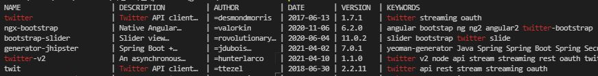
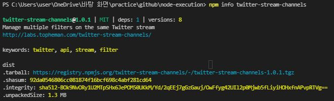

# NPM 을 이용한 의존성 확장 모듈 관리

- [NPM 을 이용한 의존성 확장 모듈 관리](#npm-을-이용한-의존성-확장-모듈-관리)
  - [npm 소개](#npm-소개)
  - [npm 사용법](#npm-사용법)
  - [npm 을 이용한 확장 모듈 설치](#npm-을-이용한-확장-모듈-설치)
    - [글로벌 설치](#글로벌-설치)
    - [로컬 설치](#로컬-설치)
  - [확장모듈 검색](#확장모듈-검색)
  - [설치된 확장 모듈 관리](#설치된-확장-모듈-관리)
  - [package.json 을 이용한 프로젝트 관리](#packagejson-을-이용한-프로젝트-관리)

기본 모듈만 사용하여 직접 작성할 수도 있지만, 다른 개발자들이 미리 만들어둔 수많은 확장 모듈들을 사용하면 필요한 기능을 훨씬 빠르게 개발할 수 있습니다.

## npm 소개

npm 은 노드를 위한 패키지 매니저입니다. 많은 개발자들이 확장 모듈을 만들고, 이 확장 모듈을 쉽게 관리해주는것이 npm 입니다.  이미 존재하는 모듈을 이용하면 생산성을 높일 수 있습니다.

서버에 배포하거나 협업하는 개발자가 개발 환경을 설정할 때 **소스가 의존하는 확장 모듈도 함께 설치**되어야 합니다. 확장 모듈은 새로 추가되거나/버전이 바뀌는 경우도 많으므로 모듈에 대한 관리가 필요하고, 이것을 npm 이 관리해줍니다.

npm 은 모든 사용자가 접근할 수 있는 [중앙저장소](https://www.npmjs.com/)를 제공하고 각 노드 개발자가 자신이 만든 모듈을 패키징해 npm 에 배포합니다. 또한 `package.json` 파일에 **프로젝트 관련 정보**와 **의존성 확장 모듈에 대한 정보**도 담고있으므로, `package.json` 만 공유하면 각 개발자가 자신의 로컬 환경에서 필요한 의존 모듈을 설치할 수 있습니다. 버전을 변경할 때도 `package.json` 만 수정하여 공유하면 됩니다.

## npm 사용법

파라미터 없이 `npm` 만 입력하면 사용할 수 있는 명령어 리스트들을 볼 수 있습니다.


``` bash
    $ npm

    Usage: npm <command>

    where <command> is one of:
        access, adduser, audit, bin, bugs, c, cache, ci, cit,
        clean-install, clean-install-test, completion, config,
        create, ddp, dedupe, deprecate, dist-tag, docs, doctor,
        edit, explore, fund, get, help, help-search, hook, i, init,
        install, install-ci-test, install-test, it, link, list, ln,
        login, logout, ls, org, outdated, owner, pack, ping, prefix,
        profile, prune, publish, rb, rebuild, repo, restart, root,
        run, run-script, s, se, search, set, shrinkwrap, star,
        stars, start, stop, t, team, test, token, tst, un,
        uninstall, unpublish, unstar, up, update, v, version, view,
        whoami

    npm <command> -h  quick help on <command>
    npm -l            display full usage info
    npm help <term>   search for help on <term>
    npm help npm      involved overview

    Specify configs in the ini-formatted file:
        C:\Users\user\.npmrc
    or on the command line via: npm <command> --key value
    Config info can be viewed via: npm help config

    npm@6.14.12 C:\Program Files\nodejs\node_modules\npm
```

## npm 을 이용한 확장 모듈 설치

npm 의 확장 모듈은 *글로벌 설치*, *로컬 설치*로 나뉩니다.

* **글로벌 설치** 
  * 커맨드라인에서 명령어로 사용할 경우
  * `/usr/local/lib` 하위의 `node_modules` 디렉토리 아래에 설치됩니다.
  * npm 설치 경로에 따라 달라질 수 있습니다.
  
* **로컬 설치**
  * 소스에서 `require('module_name')` 으로 접근할 경우
  * 현재 위치 기준으로 `node_modules` 디렉토리에 설치됩니다.

(직접 만든 모듈을 중앙저장소에 배포하거나 중앙저장소를 복사해 개인 npm 저장소를 만들 수도 있지만, 생략합니다.)

### 글로벌 설치

커맨드라인에서 사용하는 모듈은 **노드로 작성한 소스와는 의존성을 갖지않는 도구**로, 개발단계의 편의성 등을 위해 사용합니다. 

``` bash
    # $ npm install nodemon -g
    $ npm install <module_name> -g

    $ npm list -g    # 글로벌에 설치된 모듈 리스트 확인
    # $ npm ls -g    # 자세한 정보로 리스트 출력
    # $ npm ll -g    
    # $ npm la -g
```

글로벌로 설치할 경우, 아래처럼 커맨드라인에서 사용 가능합니다. (예제이므로 동작하지않습니다.)

``` bash
    $ nodemon ./server.js localhost 8080
```

### 로컬 설치

로컬 설치는 소스에서 사용해야하는 확장 모듈일 경우 사용합니다. 로컬에 설치되는 확장 모듈은 앱 소스코드와 연결되어 있기 때문에 **애플리케이션과 함께 관리**되어야 합니다.

확장 모듈을 설치하려면 특정 모듈 (`<module_name>`) 을 로컬에 설치합니다. 작성하는 애플리케이션의 루트 디렉토리(`package.json` 이 존재하는 디렉토리) 에서 다음과 같이 설치를 진행합니다.

``` bash
  # $ npm install reqeust
  $ npm install <module_name>
  $ npm install <module_name> <module_name> <module_name> ...  # 다중설치

  $ npm list    # 로컬에 설치된 모듈 리스트 확인
```

설치된 모듈은 `module-name@1.0.0` 형식으로, *모듈명@버전* 형식으로 루트 디렉토리와 함께 출력됩니다. 로컬에 설치된 모듈은 프로젝트의 루트 디렉토리의 `node_modules` 디렉토리가 생성되며, 그 아래에 설치됩니다.

모듈중에는 글로벌/로컬 설치가 둘 다 필요한 경우도 있습니다. 소스에서도 사용하지만, 커맨드라인에서 편의 기능을 제공하는 경우도 있습니다. 이런 모듈은 글로벌 설치와 로컬 설치를 따로 해주는 것이 좋습니다.

## 확장모듈 검색

npm 공식 사이트에서 직접 검색할 수도 있지만, 커맨드 라인에서 명령어로 검색할수도 있습니다.

``` bash
  # $ npm search twitter    # twitter 와 관련된 모듈 찾기
  $ npm search <module_name>
```



검색 속도를 높이기 위해 최초 실행시 확장 모듈에 대한 인덱스를 로컬에 저장하기 때문에, 초반에는 느릴 수 있습니다. 필요한 모듈을 찾았으면 모듈의 자세한 정보를 확인할 수 있습니다.

``` bash
  # $ npm info twitter-stream-channels
  $ npm info <module_name>
```


## 설치된 확장 모듈 관리

모듈을 설치한 후 최신 버전에 대한 업데이트나 필요없는 모듈 삭제 등의 관리가 필요합니다.

1. **package.json 자동 생성**

``` bash
  $ npm init
  $ npm install --save
```

`npm init` 명령어를 사용하여 package.json 을 만들 수 있습니다.

설치시 `--save` 옵션을 사용하면 존재하는 `package.json` 의 `dependencies` 필드에 자동으로 모듈에 대한 정보를 추가합니다.

2. **모듈 업데이트**
  
``` bash
  $ npm update <module_name>
```

3. **모듈 버전 지정 업데이트** 

``` bash
  # $ npm install request@2.9.0
  $ npm install <module_name>@<version>
```

4. **모듈의 이전 버전 확인**

``` bash
  $ npm info <module_name>
```

5. **설치된 모듈 삭제**

``` bash
  $ npm uninstall <module_name>
```

`uninstall` 대신 `node_modules` 에 있는 모듈의 디렉토리를 삭제해도 같습니다.

## package.json 을 이용한 프로젝트 관리

노드로 확장 모듈을 작성하면 npm 을 이용해 중앙저장소로 배포할 수 있습니다. 배포할 때 모듈에 대한 정보를 `package.json` 파일에 저장합니다. `package.json` 파일은 배포되는 모듈의 정보를 담기 위해 만들어졌지만, 노드로 작성하는 애플리케이션도 `package.json` 파일로 관리할 수 있습니다. `package.json` 은 또한 CommonJS 의 Package 명세이므로 임의로 지정할 순 없습니다..

`package.json` 은 반드시 프로젝트의 루트 위치에 존재하여야합니다.  

``` json
  {
    "name": "appication-name",
    "version": "0.0.1",
    "private": true,
    "dependencies": {
      "express": "2.4.6",
      "jade": ">= 0.0.1"
    }
  }
```

사용할 수 있는 속성이 많지만, 알아둬야할 속성 위주로 살펴봅니다.

1. **name**

프로젝트의 이름

  > npm 저장소에 배포할 경우 version 과 함께 필수값 (배포할 때 모듈의 유일한 키 값으로 사용됨)

2. **version**

프로젝트의 버전

  > `v` 로 시작할 수 있으며, 3 단계의 버전을 사용하는데, 뒤에 `-` 로 태그명을 적을 수 있음 ex) `0.1.2`, `0.1.2-beta`

3. **description**

프로젝트의 설명 - `npm search` 사용할 때 검색에 포함됨 

4. **keywords**

프로젝트의 키워드를 문자열의 배열로 작성하고 `npm search` 를 할 때 `keywords` 에 적은 문자열도 같이 찾아줌

ex) `['twitter', 'streaming', 'outh']` :: 태그 같은 느낌

5. **hompage**

프로젝트의 홈페이지 주소를 작성합니다.

6. **author**

작성자 정보로, string 으로 작성 하거나, JSON 형식으로 작성합니다.

``` json
  {
    "name": "module_name",
    "email": "module_@gmail.com",
    "url": "http://blog.module_.sample"
    // ...
  }
```

7. **contributors**

프로젝트에 참여한 사람들의 정보

8. **repository**

소스를 확인할 수 있는 저장소의 주소
    

``` json
  {
    // ...
    "repository": {
      "type": "git",
      "url": "http://git-repository-url"
    },
    "repository": {
      "type": "git",
      "url": "http://git-repository-url"
    },
    // ...
  }
 ```

9.  **scripts**

프로젝트에서 자주 실행해야하는 명령어를 `scripts` 에 작성하여 `npm` 명령어로 실행할 수 있습니다.

명령어에는 예약어가 있습니다.

* `prestart`, `start`, `poststart` 는 `npm start` 에 의해 차례대로 실행됩니다.
* `prestop`, `stop`, `poststop` 은 `npm stop` 명령어에 의해 차례대로 실행됩니다.
* `npm restart` 명령어는 `prerestart`, `restart`, `postrestart` 가 정의되어있으면 사용하고, 아닌 경우 `stop`, `start` 를 차례대로 수행합니다.

``` json
  {
    // ...
    "scripts": {
      "start": "node app.js",
      "install": "make & make install",
      "test": "node ./test/*" 
    }
    // ...
  }
```

10.  **config**

앞서 설명한 `scripts` 를 사용해 `npm start` 등으로 실행하면 소스에서 `config` 필드에 있는 값을 환경 변수 처럼 접근할 수 있습니다.

`config` 필드를 작성하면, 소스에서 `process.env.npm_package_config_port` 로 접근하여 `8080` 값을 가져올 수 있습니다. 

``` json
  {
    // ...
    "config": {
      "port": "8080"
    }
  }
```

11.  **private**

`private` 를 `true` 로 설정하면, 이 프로젝트를 npm 저장소에 배포하지 않습니다.

12.  **dependencies** 🦄🦄🦄

`dependencies` 필드를 사용하여 의존성 모듈의 관리를 할 수 있으므로 매우 유용합니다. npm 으로 프로젝트에 필요한 확장 모듈을 설치한 뒤에도, 확장 모듈의 *관리*가 매우 중요합니다.

공동으로 개발하는 경우, 함께 개발하는 모든 개발자가 같은 환경에서 개발해야 합니다. 확장 모듈에 대한 관리가 없으면 버전에 차이가 있을 수 있으므로, 그에 따른 에러가 발생할 수도 있습니다.

이러한 상황을 방지하기 위해서 `dependencies` 필드로 의존성 확장 모듈을 관리합니다. `package.json` 만 제대로 공유한다면 누구나 같은 버전의 모듈을 사용할 수 있습니다.

> 참고 :: 확장 모듈이 설치되는 `node_module` 디렉토리는 원격 저장소에 올리지 않도록 `git ignore` 로 제외시킵니다.

``` json
  {
    "dependencies": {
      "express": "2.4.6",
      "jade": ">= 0.0.1"
    }
    // ...
  }
```

버전을 표기하는 방법은 아래 표에 명시되어있습니다.

| 표기                  | 설명                                                                                                                                                                                                                                                 |
| --------------------- | ---------------------------------------------------------------------------------------------------------------------------------------------------------------------------------------------------------------------------------------------------- |
| `version`             | `version` 과 일치하는 버전을 설치                                                                                                                                                                                                                    |
| `=version`            | `version` 과 일치하는 버전을 설치                                                                                                                                                                                                                    |
| `>version`            | `version` 보다 큰 최신 버전을 설치                                                                                                                                                                                                                   |
| `>=version`           | `version` 보다 크거나 같은 최신 버전 설치                                                                                                                                                                                                            |
| `<version`            | `version` 보다 작은 최신 버전 설치                                                                                                                                                                                                                   |
| `<=version`           | `version` 보다 작거나 같은 최신 버전 설치                                                                                                                                                                                                            |
| `~version`            | npm 의 버전은 3 단계 버전 번호 형식을 사용하는데,<br>`~` 를 사용하면 최소한 `version` 보다는 크거나 같으면서 상위 단계의 메이저 버전보다는 작은 범위 내의 최신 버전을 설치합니다. <br>ex) `2.0.0` > `~1` >= `1.0.0` \|\| `2.0.0` > `~1.2` >= `1.2.0` |
| `1.2.x`               | `1.2.x` 형식에 맞는 최신 버전 설치                                                                                                                                                                                                                   |
| `*`                   | 별도의 버전을 명시하지 않고 최신 버전을 설치                                                                                                                                                                                                         |
| `""`                  | 별도의 버전을 명시하지 않고 최신 버전을 설치                                                                                                                                                                                                         |
| `version1 - version2` | `version1` 보다 크거나 같고, `version2` 보다 작거나 같은 버전 설치                                                                                                                                                                                   |
| `range1 || range2`    | 버전 범위를 OR 조건으로 이어 붙입니다. ex) `>= 1.0 || < 1.2.2` 와 같이 작성                                                                                                                                                                          |
| `http://...`          | tar 압축 파일의 URL 을 작성하면 다운로드해 로컬에 설치                                                                                                                                                                                               |


13.  **devDependencies**

`dependencies` 와 이름은 같지만 **개발할 때만 필요한 모듈**입니다. 여기에 명시된 모듈은 `config` 에 `production === true` 일 경우에는 설치하지 않습니다. (`production` 의기본값은 `false` 입니다.) 

``` bash
  $ npm config set production true  # production 모드로 설정
  $ npm config list -l              # config 값 확인하기
```

14.  **engine**

npm 에서는 `dependencies` 에서 사용한 버전 표시 방식을 다음과 같이 작성합니다.

``` json
   {
     "engines": { "node" : ">=0.4.0 < 0.4.11" }
     // ...
   }
```